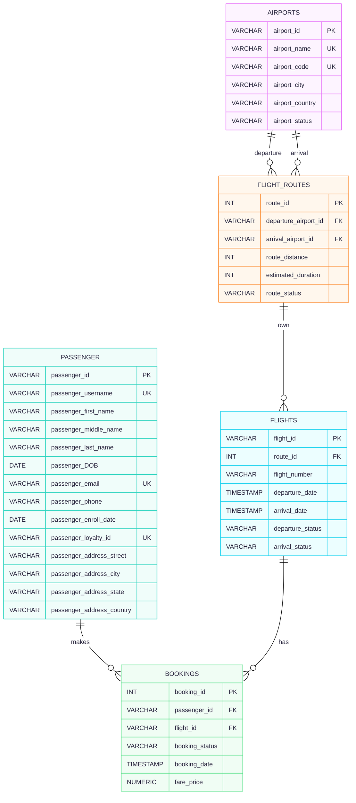

# EX603 Assignment - Paw Airline Booking Database

**Summary:**

Airline Booking database for our new airline company Paw Air. This databsase will store date for passengers, flights, bookings, airports, flight_routes information. 

**Domain:** 

The main purpose of this database is to store and allow processing of the airline flight, passenger and booking information. The database is mainly use for tracking and recording all the online bookings in the official airline site, but not third party or in person bookings. Users for this table will be internal staffs in the company, such as IT, production support, customer services, business development, marketing, machine learning and also enterprise data stragety. This table enable analysis, reporting and triaging system issue in production and provide real time data from request. 

**Schema：**

Below are the five roles for the Paw Airline Booking database and our design decisions. Each role is created into each own seperate table.

actor - passengers
producer - flights
event - bookings
catalog - airports
junction - flight_routes

**Design decisions**
passengers:

flights:

bookings:

airports:

flight_routes:

**Paw Airline Booking ERD:**

>airline-booking ERD using mermaid diagram

4. Query catalogue — per unit, a short table listing the queries and the business question each answers, linked to the .sql files.

5. Technical highlights — three to five things a reader should notice:
    - Flight and airports information are closely related to each other and likey be use together to perform join for flight information 
    - 
    - 

6. What I would do differently?

    I would look more into other possible attribute and see example airline site for references. I would also look into other possible issue and difficulties when this table is used by different audience or users. 

7. Video presentation — embed or link the video.

8. How to run it — the commands to create the schema and execute a query. Assume the reader has a database and nothing else.