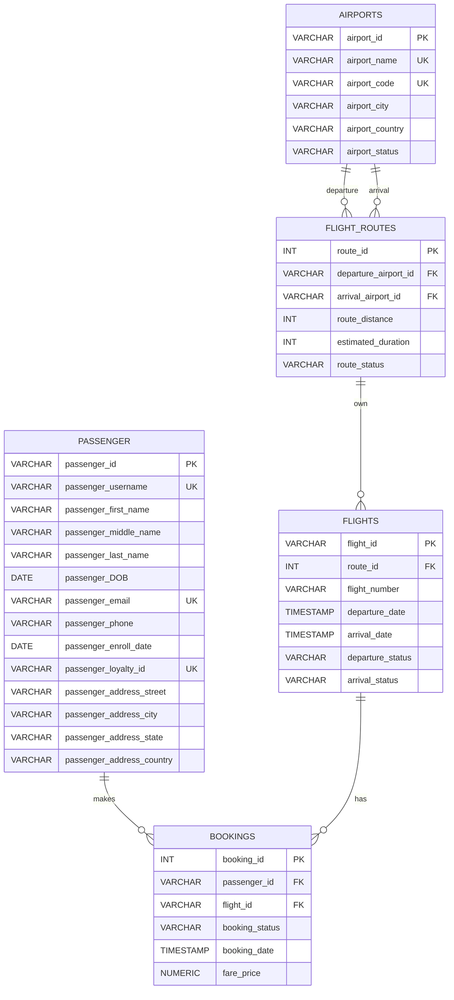

# Schema Definition

**Task 1.1: all five relation schemas, their attributes, domains, and primary keys.**

**5 Relation schemas for Paw Airline Booking Database:**
- passengers
- flights
- bookings
- airports
- flight_routes

**Attributes, domains, primary keys(PK) and foreign keys(FK) in each schema are listed below:**

# Airline Reservation Database ERD

-Add Check & constrain
-Submit 2 SS
-Update mermaid PNG
-MD. Reasoning